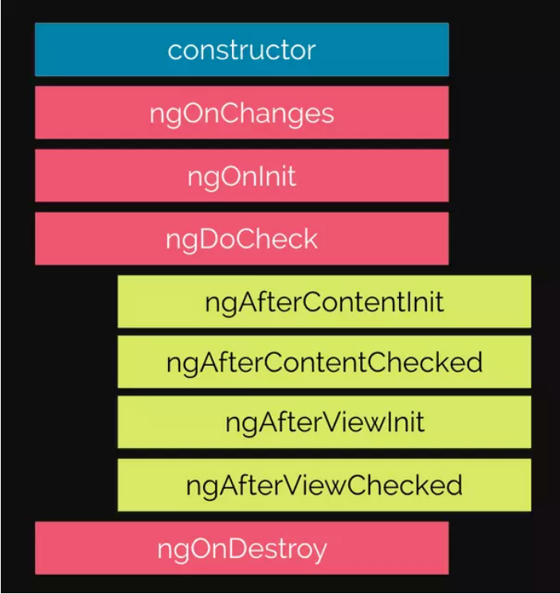

# CONCEPT ANGULAR

[Create new project](#create-new-project)
[Create new component](#create-new-component)
[Interpolation (Nội suy)](#interpolation-nội-suy)
[Property Binding](#property-binding)
[Event Binding](#event-binding)
[Two-way binding](#two-way-binding)
[Directives](#directives)
[Pipes](#pipes)
[Sharing data parent to child and otherwise](#sharing-data-parent-to-child-and-otherwise)
[Lifecycle Hooks](#lifecycle-hooks)
[Services](#services)
[Dependency Injection (DI)](#dependency-injection-di)
[Routing](#routing)

---

## Create new project

-   To install new project about **Angular**, laptop need to `2` things:

    -   **Node.js** environment
    -   **@angular/cli**: `npm install -g @angular/cli`

-   The steps create new project:

    -   **S1**: `ng new my-app`
    -   **S2**: `cd my-app` and `npm start` with `http://localhost:4200`

- How to switch install between `npm` and `yarn`: `ng config -g cli.packageManager yarn`

## Create new component

-   A **component** contains `4`:

    -   **component file**: `<component-name>.component.ts`
    -   **template(html) file**: `<component-name>.component.html`
    -   **css file**: `<component-name>.component.css`
    -   **testing specification file**: `<component-name>.component.spec.ts`

-   only `app file` have **module file**: `<component-name>.module.ts`

-   We can use `command` to generate a **component**: `ng generate component name-file`
-   We can use generate to see command `generate` : `ng generate --help`

1. ### Component file

-   `Interface` must be on top **component**, only after `all import`

```ts
import {Component} from '@angular/core'

export interface Book{
    name: string
    author: string
}

@Component({
    selector: name-tag 'app',
    templateUrl: './app.component.html',
    stylesUrl: ['app.component.css'], // list url style

    template: '<h1>Hello world</h1>',
    styles: ['h1 { color: red }'],
})

export class AppComponent{
    bookList: Book[] = [
        {
            name: 'Clean Coding',
            author: 'Robert C Max',
        },
        {
            name: "I'm coding",
            author: 'Pham Huy Hoang',
        },
    ]
}
```

2. ### Template file (HTML)

```html
<div class="books">
    <ul class="book__list">
        <li class="book__item">{{ name }}</li>
        <li class="book__item">{{ name }}</li>
        <li class="book__item">{{ name }}</li>
        <li class="book__item">{{ name }}</li>
    </ul>
</div>
```

3. ### Style file (CSS)

```css
.book__list {
    display: flex;
    justify-content: center;
    align-items: center;
}

.book__item {
    color: #fff;
}
```

4. ### Testing specification file

-   It use testing `a component`

```ts
import { ComponentFixture, TestBed } from '@angular/core/testing'

import { HeaderComponent } from './header.component'

describe('HeaderComponent', () => {
    let component: HeaderComponent
    let fixture: ComponentFixture<HeaderComponent>

    beforeEach(async () => {
        await TestBed.configureTestingModule({
            declarations: [HeaderComponent],
        }).compileComponents()

        fixture = TestBed.createComponent(HeaderComponent)
        component = fixture.componentInstance
        fixture.detectChanges()
    })

    it('should create', () => {
        expect(component).toBeTruthy()
    })
})
```

5. ### Module file (only file app)

```ts
import { NgModule, BrowserModule } from '@angular/core'

@NgModule({
    declarations: [AppComponent], // declare a list component, lets Angular know to associate this new component with this feature module.
    imports: [BrowserModule],
    bootstrap: [AppComponent], // this is important, it use to show UI to web browser
})
export class AppModule {}
```

## Interpolation (Nội suy)

-   **Interpolation** refers to embedding expressions into marked up next.
-   Use `{{}}` (curly brace) in `component`, Angular find this variable in `component`

-   app.component.html

```html
<p>{{ title }}</p>
```

-   app.component.ts

```ts
import {Component} from '@angular/core'

@Component({
    selector: name-tag 'app',
    templateUrl: './app.component.html',
    stylesUrl: ['app.component.css'], // list url style

    template: '<h1>Hello world</h1>',
    styles: ['h1 { color: red }'],
})

export class AppComponent{
    title: string = 'Hello world'
}
```

## Property Binding

-   **Property Binding** use to binding a property to element in view HTML.
-   Update value of property in view and binding it to a element.
-   `[property-element]="name-variable"`

-   **test.component.html**

```html
// it understand buttonDisabled is string, disabled is true
<button disabled="{{ buttonDisabled }}"></button>

// fixed use property binding
<button [disabled]="buttonDisabled"></button>
```

-   **test.component.ts**

```ts
import { Component } from '@angular/core'

@Component({
    templateUrl: 'component.html',
    selector: 'app-component',
})
export class Component {
    buttonDisabled = true
}
```

> **Tức là**, nó sẽ giúp cho chúng ta thiết lập các `property` cho element trong view. Update 1 giá trị của 1 `property` trong view và ràng buộc nó đến 1 element. Khi value thay đổi thì `property` cũng sẽ thay đổi dựa vào value đó và nó hiểu đó là giá trị gì (boolean, string, number,...)

## Event Binding

-   **Event Binding** lets you listen and respond user actions event `such us` click, key event, mouse event, change, input,...
-   `<element (event)="fn(parameter1, parameter2,...)">text</element>`, **import** function must be call now.

-   **app.component.html**

```html
<button (click)="handleClick()">Click</button>
```

-   **app.component.ts**

```ts
import { Component } from '@angular/core'

@Component({
    templateUrl: 'component.html',
    selector: 'app-component',
})
export class Component {
    handleClick(): void {
        console.log('Hello world')
    }
}
```

> **Tức là**, nó cho phép chúng ta tạo event như click, mouse event, key event, change, input,....

## Two-way binding

-   **Two-way binding** lets components share data two-way binding.
-   Use **two-way binding** to listen event and update value between parent and child component.
-   This is **combine** `property binding` and `event binding`.

```html
<button [(click)]="handleClick()">Click</button>
```

## Directives

1. ### Component directives

2. ### Attribute directives

-   You can generate directives: `ng generate directive file-name`

```ts
import { Directive } from '@angular/core'

@Directive({
    selector: '[appHighlight]',
})
export class HighlightDirective {
    constructor() {}
}
```

-   **NgClass**: adds and removes a set of CSS classes.

```html
<!-- toggle the "special" class on/off with a property -->
<div [ngClass]="isSpecial ? 'special' : ''">This div is special</div>
```

-   **NgStyle**: style for template

-   **NgModel**: two-way binding, use display and update property

1. ### Structural directives

-   **NgIf**: it use check conditional in HTML

```html
<div *ngIf="time; else noTime">Time: {{time}}</div>
<ng-template #noTime> No time. </ng-template>
```

-   **NgTemplate**: It collect all element HTML need to hide or show, render in HTML code `(Nó dùng để gom code HTML khi dùng nó để ẩn hoặc hiện trên website khi kết hợp với NgIf)`

```html
<div *ngIf="isTrue; then tmplWhenTrue else tmplWhenFalse"></div>
<ng-template #tmplWhenTrue>I show-up when isTrue is true. </ng-template>
<ng-template #tmplWhenFalse> I show-up when isTrue is false </ng-template>
```

-   **NgContainer**: it same `NgTemplate`, **but** it doesn't render to HTML code, tag **NgContainer** hidden, make layout website can't break `(Tức là, nó cũng giống như NgTemplate nhưng tag của nó ko render (ẩn đi) trên HTML, giúp cho layout web ko bị vỡ ra)`

```html
Welcome <ng-container *ngIf="title">to <i>the</i> {{title}} world.</ng-container>
```

-   **NgFor**: loop element in iterable (array)

```html
<ul>
    <li *ngFor="let book of books; let i=index">{{ i }} {{ book.name }}</li>
    <!-- books in component file -->
</ul>
```

-   **NgSwitch**: use conditional `switch case`

```html
<div [ngSwitch]="isMetric">
    <div *ngSwitchCase="true">Degree Celsius</div>
    <div *ngSwitchCase="false">Fahrenheit</div>
    <div *ngSwitchDefault>Default</div>
</div>
```

## Pipes

-   **Pipes** use mutate output value, show to template HTML such us lowercase, titlecase, datetime, currency,...

```ts
#src / app / hero - birthday1.component.ts

import { Component } from '@angular/core'

@Component({
    selector: 'app-hero-birthday',
    template: `<p>The hero's birthday is {{ birthday | date }}</p>`, // format date
})
export class HeroBirthdayComponent {
    birthday = new Date(1988, 3, 15)
}
```

-   **Parameters in Pipes**: you can add parameter by use `:`, ex: `currency:'EUR'`

```html
<p>The hero's birthday is {{ birthday | date:"MM/dd/yy" }}</p>
```

-   **String in Pipes**: uppercase | lowercase | titlecase

```html
<p>
    The chained hero's birthday is {{ birthday | date:'fullDate' | uppercase | lowercase |
    titlecase}}
</p>
```

-   **Custom in Pipes**:

```ts
#src / app / exponential - strength.pipe.ts

import { Pipe, PipeTransform } from '@angular/core'
/*
 * Raise the value exponentially
 * Takes an exponent argument that defaults to 1.
 * Usage:
 *   value | exponentialStrength:exponent
 * Example:
 *   {{ 2 | exponentialStrength:10 }}
 *   formats to: 1024
 */
@Pipe({ name: 'exponentialStrength' })
export class ExponentialStrengthPipe implements PipeTransform {
    transform(value: number, exponent?: number): number {
        return Math.pow(value, isNaN(exponent) ? 1 : exponent)
    }
}
```

-   .component.ts:

```ts
#src / app / power - booster.component.ts

import { Component } from '@angular/core'

@Component({
    selector: 'app-power-booster',
    template: `
        <h2>Power Booster</h2>
        <p>Super power boost: {{ 2 | exponentialStrength: 10 }}</p>
    `,
})
export class PowerBoosterComponent {}
```

## Sharing data parent to child and otherwise

-   **Parent to child**: use `@Input` from `@angular/core`

    -   Pass param book for book component

```html
# books.component.html

<ul>
    <ng-container *ngFor="let book of books">
        <app-book [book]="book"></app-book>
    </ng-container>
</ul>
```

    - Use get book from books

```ts
# book.component.ts

import { Component, EventEmitter, Input, OnInit, Output } from '@angular/core'
import { Book } from '../books/books.component'

@Component({
    selector: 'app-book-item',
    templateUrl: './book-item.component.html',
    styleUrls: ['./book-item.component.css'],
})
export class BookComponent implements OnInit {
    @Input() book: Book = {} as Book

    constructor() {}

    ngOnInit(): void {}

}
```

-   **Child to parent**: use `@Output` from `@angular/core`

```ts
# book.component.ts

import { Output, EventEmitter } from '@angular/core'
export class BookComponent {

    @Output() bookEmitter = new EventEmitter<Book>();

    addNewItem(book: Book) {
    this.bookEmitter.emit(book);
    }
}
```

```html
# books.component.html

<ul>
    <ng-container *ngFor="let book of books">
        <app-book (bookEmitter)="addToCart($event)" [book]="book"></app-book>
    </ng-container>
</ul>
```

```ts
# books.component.ts

import { Output, EventEmitter } from '@angular/core'
export class BookComponent {
    @Output() bookEmitter = new EventEmitter<Book>();

    newBookList: Book[] = []
    addNewItem(book: Book) {
        newBookList.push(book)
    }
}
```

## Lifecycle Hooks

```ts
export class Foo implements OnInit {
    constructor(private logger: LoggerService) {}

    // implement OnInit's `ngOnInit` method
    ngOnInit() {
        this.logIt(`OnInit`)
    }

    logIt(msg: string) {
        this.logger.log(`#${nextId++} ${msg}`)
    }
}
```

-   **Means**:

    -   **OnInit**: it is a interface
    -   **ngOnInit**: it is a hook

-   The lifecycle hooks:



-   **The lifecycle basic**: `constructor` -> `ngOnInit` -> `ngOnDestroy`

```ts
export class Foo implements OnInit, OnDestroy {
    constructor(private logger: LoggerService) {}

    timer: any = null
    ngOnInit() {
        this.timer = setInterval(() => console.log('Hello world'), 1000)
    }

    ngOnDestroy() {
        clearInterval(this.timer)
    }
}
```

## Services

## Dependency Injection (DI)

## Routing

-   **Install package**: `npm install @angular/router`
-   **Generate file router**: `app-routing.module.ts`

```ts
import { NgModule } from '@angular/core'
import { RouterModule, Routes } from '@angular/router'
import { AboutComponent } from './features/about/about.component'
import { BooksComponent } from './features/books/books.component'
import { ContactComponent } from './features/contact/contact.component'
import { HomeComponent } from './features/home/home.component'

const routes: Routes = [
    {
        path: '',
        component: HomeComponent,
    },
    {
        path: 'about',
        component: AboutComponent,
    },
    {
        path: 'books',
        component: BooksComponent,
    },
    {
        path: 'contact',
        component: ContactComponent,
    },
]

@NgModule({
    imports: [RouterModule.forRoot(routes)],
    exports: [RouterModule],
})
export class AppRoutingModule {}
```

-   **Add class AppRoutingModule** to file `app.module.ts` imports list
-   **File app.component.html** only use: `<router-outlet></router-outlet>` to direct by router

-   **Setup navigate by tag <a></a>**:

```html
<nav>
    <ul>
        <li>
            <a
                routerLink="/first-component"
                routerLinkActive="active"
                ariaCurrentWhenActive="page"
                >First Component</a
            >
        </li>
        <li>
            <a
                routerLink="/second-component"
                routerLinkActive="active"
                ariaCurrentWhenActive="page"
                >Second Component</a
            >
        </li>
    </ul>
</nav>
```
