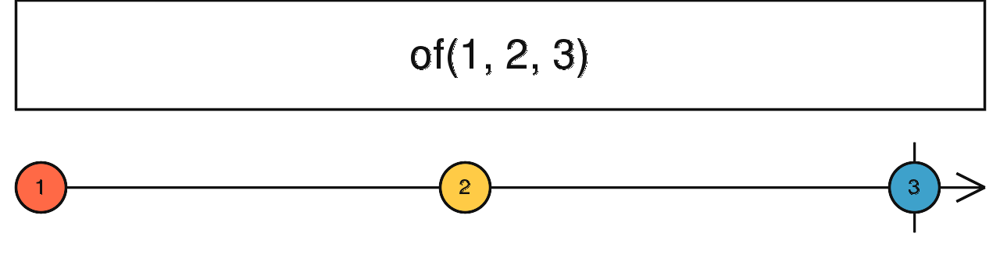
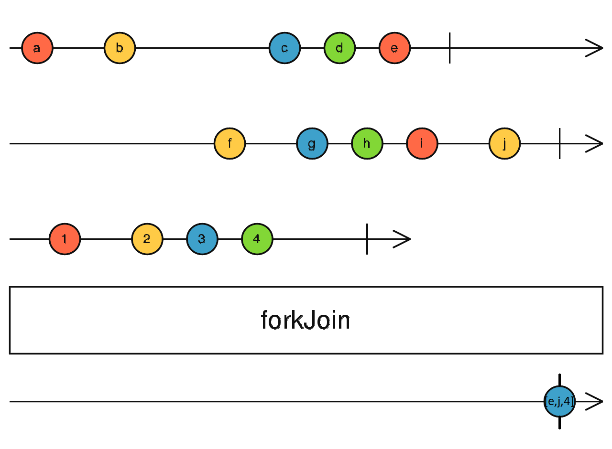
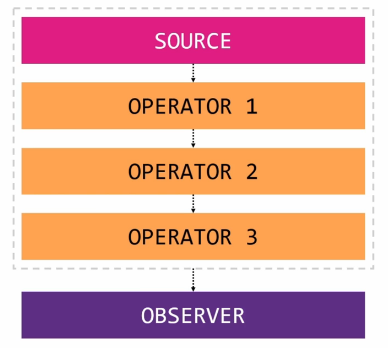
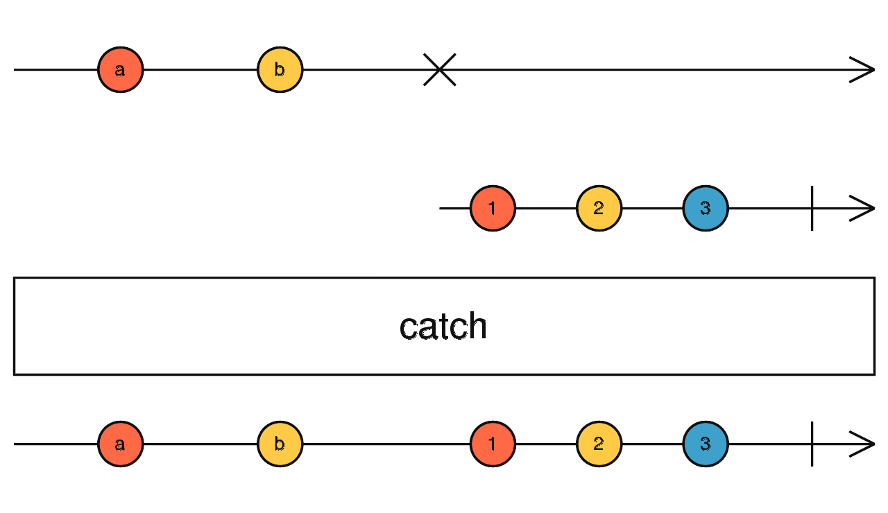

# CONCEPT ANGULAR

- [CONCEPT ANGULAR](#concept-angular)
  - [Create new project](#create-new-project)
  - [App Module](#app-module)
  - [Data Binding (Ràng buộc dữ liệu)](#data-binding-ràng-buộc-dữ-liệu)
  - [Create new component](#create-new-component)
  - [String Interpolation (Nội suy chuoi)](#string-interpolation-nội-suy-chuoi)
  - [Property Binding](#property-binding)
  - [Event Binding](#event-binding)
  - [Two-way binding](#two-way-binding)
  - [Directives](#directives)
    - [Component directives](#component-directives)
    - [Attribute directives](#attribute-directives)
    - [Structural directives](#structural-directives)
    - [How to create directives attribute](#how-to-create-directives-attribute)
  - [Content Projection (ng-content)](#content-projection-ng-content)
    - [How to use it](#how-to-use-it)
  - [ng-template, ngTemplateOutlet and ng-container](#ng-template-ngtemplateoutlet-and-ng-container)
    - [When use ng-template](#when-use-ng-template)
    - [ngTemplateOutlet](#ngtemplateoutlet)
  - [Pipes](#pipes)
  - [Sharing data parent to child and otherwise](#sharing-data-parent-to-child-and-otherwise)
  - [Lifecycle Hooks](#lifecycle-hooks)
  - [Services](#services)
    - [Services](#services-1)
    - [Why would you Need Services:](#why-would-you-need-services)
    - [How to Create Services:](#how-to-create-services)
    - [Hierarchical Injector](#hierarchical-injector)
  - [Dependency Injection (DI)](#dependency-injection-di)
  - [Routing](#routing)
    - [Install routing](#install-routing)
    - [Pass Parameters](#pass-parameters)
    - [Fetching router parameter (Get data from URL by snapshot)](#fetching-router-parameter-get-data-from-url-by-snapshot)
    - [Passing queryParams \& Fragments](#passing-queryparams--fragments)
    - [Nested Routes](#nested-routes)
    - [Protecting Route](#protecting-route)
  - [Pipes](#pipes-1)
    - [Concept Pipes](#concept-pipes)
    - [Use Pipes](#use-pipes)
    - [Custom Pipes](#custom-pipes)
  - [Observables](#observables)
    - [Concept Observables \& Observer](#concept-observables--observer)
    - [How to code Observables with subscribe \& unsubscribe](#how-to-code-observables-with-subscribe--unsubscribe)
    - [Custom a Observable with: next, error, complete](#custom-a-observable-with-next-error-complete)
    - [Pipes with operators `rxjs`](#pipes-with-operators-rxjs)
    - [Subjects](#subjects)
  - [Making HTTP request](#making-http-request)
    - [Introduce Interceptor](#introduce-interceptor)
    - [Change Request Interceptor](#change-request-interceptor)
    - [Response Interceptors](#response-interceptors)
    - [Multi Interceptors](#multi-interceptors)
  - [Lazy loading](#lazy-loading)
    - [Set up lazy loading](#set-up-lazy-loading)
    - [Pre Lazy Loading](#pre-lazy-loading)
  - [Standalone Component](#standalone-component)
    - [Why we want Standalone Component \& How setup](#why-we-want-standalone-component--how-setup)
    - [Standalone Component](#standalone-component-1)
    - [Standalone Directive](#standalone-directive)
    - [Standalone Root Component](#standalone-root-component)
    - [Services \& Standalone Component](#services--standalone-component)
    - [Routing with Standalone Component](#routing-with-standalone-component)
  - [NgRx](#ngrx)
  - [RxJS](#rxjs)
    - [Create Functions](#create-functions)
    - [Pipeable Operators](#pipeable-operators)
    - [Flattening Operators](#flattening-operators)

---

## Create new project

-   **Angular** is JS Framework
-   To install new project about **Angular**, laptop need to `2` things:

    -   **Node.js** environment
    -   **@angular/cli**: `npm install -g @angular/cli`

-   The steps create new project:

    -   **S1**: `ng new my-app`
    -   **S2**: `cd my-app` => `npm start` => run web with `http://localhost:4200`

-   How to switch install between `npm` and `yarn`: `ng config -g cli.packageManager yarn`

---

## App Module

```ts
import { NgModule } from '@angular/core'
import { FormsModule } from '@angular/forms'
import { BrowserModule } from '@angular/platform-browser'
import { AppRoutingModule } from './app-routing.module'
import { AppComponent } from './app.component'
import { BookItemComponent } from './features/book-item/book-item.component'
import { BooksComponent } from './features/books/books.component'
import { HeaderComponent } from './features/header/header.component'
import { MainComponent } from './features/main/main.component'
import { TestComponent } from './test/test.component'
import { HomeComponent } from './features/home/home.component'
import { AboutComponent } from './features/about/about.component'
import { ContactComponent } from './features/contact/contact.component'

@NgModule({
    declarations: [
        // declaration all component in my app
        AppComponent,
        BooksComponent,
        BookItemComponent,
        HeaderComponent,
        MainComponent,
        TestComponent,
        HomeComponent,
        AboutComponent,
        ContactComponent,
    ],
    imports: [BrowserModule, FormsModule, AppRoutingModule], // it allow you add some other modules
    providers: [],
    bootstrap: [AppComponent],
})
export class AppModule {}
```

---

## Data Binding (Ràng buộc dữ liệu)

-   **Data binding** == **Communication**
-   **Data binding** is `communication` between `Typescript code` and `Template HTML`; when data in `Typescript code` change, `Template HTML` (UI) also change by data in `Typescript code`.

-   **Data binding** contains:
    -   String Interpolation
    -   Property Binding
    -   Event Binding
    -   Two-way Binding


## Create new component

-   A **component** contains `4`:

    -   `component file`: `<component-name>.component.ts`
    -   `template(html) file**`: `<component-name>.component.html`
    -   `css file`: `<component-name>.component.css`
    -   `testing specification file`: `<component-name>.component.spec.ts`

-   only `app file` have **module file**: `<component-name>.module.ts`

-   We can use `command` to generate a **component**: `ng generate component name-file` or `ng g c name-file`
-   We can use generate to see command `generate` : `ng generate --help`

1. ### Component file

-   `Interface` must be on top **component**, only after `all import`

```ts
import { Component } from '@angular/core'

export interface Book {
    name: string
    author: string
}

@Component({
    selector: name-tag 'app',
    templateUrl: './app.component.html',
    stylesUrl: ['app.component.css'], // list url style

    template: '<h1>Hello world</h1>',
    styles: ['h1 { color: red }'],
})

export class AppComponent{
    bookList: Book[] = [
        {
            name: 'Clean Coding',
            author: 'Robert C Max',
        },
        {
            name: "I'm coding",
            author: 'Pham Huy Hoang',
        },
    ]
}
```

2. ### Template file (HTML)

```html
<div class="books">
    <ul class="book__list">
        <li class="book__item">{{ name }}</li>
        <li class="book__item">{{ name }}</li>
        <li class="book__item">{{ name }}</li>
        <li class="book__item">{{ name }}</li>
    </ul>
</div>
```

3. ### Style file (CSS)

```css
.book__list {
    display: flex;
    justify-content: center;
    align-items: center;
}

.book__item {
    color: #fff;
}
```

4. ### Testing specification file

-   It use testing `a component`

```ts
import { ComponentFixture, TestBed } from '@angular/core/testing'

import { HeaderComponent } from './header.component'

describe('HeaderComponent', () => {
    let component: HeaderComponent
    let fixture: ComponentFixture<HeaderComponent>

    beforeEach(async () => {
        await TestBed.configureTestingModule({
            declarations: [HeaderComponent],
        }).compileComponents()

        fixture = TestBed.createComponent(HeaderComponent)
        component = fixture.componentInstance
        fixture.detectChanges()
    })

    it('should create', () => {
        expect(component).toBeTruthy()
    })
})
```

5. ### Module file (only file app)

```ts
import { NgModule, BrowserModule } from '@angular/core'

@NgModule({
    declarations: [AppComponent], // declare a list component, lets Angular know to associate this new component with this feature module.
    imports: [BrowserModule],
    bootstrap: [AppComponent], // this is important, it use to show UI to web browser
})
export class AppModule {}
```

---

## String Interpolation (Nội suy chuoi)

-   **Interpolation** refers to embedding expressions into marked up next.
-   Use `{{}}` (curly brace) in `component`, Angular find this variable in `component`

-   app.component.html

```html
<p>I say {{ title }}, you too {{ sayHi() }}</p>
```

-   app.component.ts

```ts
import {Component} from '@angular/core'

@Component({
    selector: name-tag 'app',
    templateUrl: './app.component.html',
    stylesUrl: ['app.component.css'], // list url style

    template: '<h1>Hello world</h1>',
    styles: ['h1 { color: red }'],
})

export class AppComponent{
    title: string = 'Hello world'

    sayHi(): void{
        return this.title
    }
}
```

---

## Property Binding

-   **Property Binding** use to binding a property to element in view HTML.
-   Update value of property in view and binding it to a element.
-   `[property-element]="name-variable"`

-   **test.component.html**

```html
// it understand buttonDisabled is string, disabled is true
<button disabled="{{ buttonDisabled }}"></button>

// fixed use property binding
<button [disabled]="buttonDisabled"></button>
```

-   **test.component.ts**

```ts
import { Component } from '@angular/core'

@Component({
    templateUrl: 'component.html',
    selector: 'app-component',
})
export class Component {
    buttonDisabled = true
}
```

> **Tức là**, nó sẽ giúp cho chúng ta thiết lập các `property` cho element trong view. Update 1 giá trị của 1 `property` trong view và ràng buộc nó đến 1 element. Khi value thay đổi thì `property` cũng sẽ thay đổi dựa vào value đó và nó hiểu đó là giá trị gì (boolean, string, number,...)

---

## Event Binding

-   **Event Binding** lets you listen and respond user actions event `such us` click, key event, mouse event, change, input,...
-   `<element (event)="fn(parameter1, parameter2,...)">text</element>`, **import** function must be call now.

-   **app.component.html**

```html
<button (click)="handleClick()">Click</button>
```

-   **app.component.ts**

```ts
import { Component } from '@angular/core'

@Component({
    templateUrl: 'component.html',
    selector: 'app-component',
})
export class Component {
    handleClick(): void {
        console.log('Hello world')
    }
}
```

> **Tức là**, nó cho phép chúng ta tạo event như click, mouse event, key event, change, input,....

---

## Two-way binding

-   **Two-way binding** lets components share data two-way binding.
-   Use **two-way binding** to listen event and update value between parent and child component.
-   This is **combine** `property binding` and `event binding`.

```html
<button [(click)]="handleClick()">Click</button>
```

## Directives

-   Install directives:

```
ng generate directive file-name
# or
ng g d file-name
```

### Component directives

### Attribute directives

-   **NgClass**: adds and removes a set of CSS classes.

```html
<div [ngClass]="isSpecial ? 'special' : ''">This div is special</div>
<div [ngClass]="{special: isSpecial}">This div is special</div>
```

-   **NgStyle**: style for template

```html
<div [ngStyle]="backgroundColor: odd % 2 === 0 ? 'red' : ''">...</div>
```

-   **NgModel**: two-way binding, use display and update property

### Structural directives

-   **NgIf**: it use check conditional in HTML

```html
<div *ngIf="time; else noTime">Time: {{time}}</div>
<ng-template #noTime>No time.</ng-template>
```

-   **NgTemplate**: It collect all element HTML need to hide or show, render in HTML code `(Nó dùng để gom code HTML khi dùng nó để ẩn hoặc hiện trên website khi kết hợp với NgIf)`

```html
<div *ngIf="isTrue; then tmplWhenTrue else tmplWhenFalse"></div>
<ng-template #tmplWhenTrue>I show-up when isTrue is true. </ng-template>
<ng-template #tmplWhenFalse> I show-up when isTrue is false </ng-template>
```

-   **NgContainer**: it same `NgTemplate`, **but** it doesn't render to HTML code, tag **NgContainer** hidden, make layout website can't break `(Tức là, nó cũng giống như NgTemplate nhưng tag của nó ko render (ẩn đi) trên HTML, giúp cho layout web ko bị vỡ ra)`

```html
Welcome <ng-container *ngIf="title">to <i>the</i> {{title}} world.</ng-container>
```

-   **NgFor**: loop element in iterable (array)

```html
<ul>
    <li *ngFor="let book of books; let i=index">{{ i }} {{ book.name }}</li>
    <!-- books in component file -->
</ul>
```

-   **NgSwitch**: use conditional `switch case`

```html
<div [ngSwitch]="isMetric">
    <div *ngSwitchCase="true">Degree Celsius</div>
    <div *ngSwitchCase="false">Fahrenheit</div>
    <div *ngSwitchDefault>Default</div>
</div>
```

> `ngFor` and `ngIf` can't together in a tag (`kHÔNG THỂ ĐẶT CHUNG VỚI NHAU ĐC :((`)

```html
<div class="products">
    <div class="product" *ngFor="let product of products" *ngIf="product.id !== 1">
        ....
    </div>
    <!-- ERROR -->
    <div></div>
</div>
```

### How to create directives attribute

```ts
import { Directive, ElementRef, OnInit } from '@angular/core'

@Directive({
    selector: '[appHighlightText]',
})
export class HighlightTextDirective implements OnInit {
    constructor(private elementRef: ElementRef) {}

    ngOnInit(): void {
        this.elementRef.nativeElement.style.color = 'red'
    }
}

// `elementRef` use to referent element to style or more...
```

**html** file

```html
<h3 appHighlightTextDirective>Title....</h3>
<!-- text has color red -->
```

---

## Content Projection (ng-content)

When the component the same but difference about content in this component (`Như ta dùng children trong React để chèn nội dung riêng biệt giữa các component giống nhau`)

### How to use it

Style code selectors:

-   Tag selector: <ng-content select="some-component-selector-or-html-tag"></ng-content>
-   CSS Class selector: <ng-content select=".some-class"></ng-content>
-   Attribute selector: <ng-content select="[some-attr]"></ng-content>
-   Combine multiple selectors: <ng-content select="some-component-selector-or-html-tag[some-attr]"></ng-content>

**product-list.html**

```html
<div class="product-list">
    <div *ngFor="let product of productList">
        <app-product-item [product]="product">
            <h3 class="product__title">{{ product.title }}</h3>
            <button class="btn-product-click">{{ product.contentBtn }}</button>
        </app-product-item>
    </div>
</div>
```

**product-list.component.ts**

```ts
import { Component, OnInit } from '@angular/core'

export interface Product {
    title: string
    description: string
    contentBtn: string
}

@Component({
    selector: 'app-product-list',
    templateUrl: './product-list.component.html',
    styleUrls: ['./product-list.component.scss'],
})
export class ProductListComponent implements OnInit {
    constructor() {}

    ngOnInit(): void {}

    productList: Product[] = [
        {
            title: 'Title 1',
            description:
                'Lorem Ipsum is simply dummy text of the printing and typesetting industry. Lorem Ipsum has been the industry standard dummy text ever since the 1500s',
            contentBtn: 'Click 1',
        },
        {
            title: 'Title 2',
            description:
                'Lorem Ipsum is simply dummy text of the printing and typesetting industry. Lorem Ipsum has been the industry standard dummy text ever since the 1500s',
            contentBtn: 'Click 2',
        },
        {
            title: 'Title 3',
            description:
                'Lorem Ipsum is simply dummy text of the printing and typesetting industry. Lorem Ipsum has been the industry standard dummy text ever since the 1500s',
            contentBtn: 'Click 3',
        },
        {
            title: 'Title 4',
            description:
                'Lorem Ipsum is simply dummy text of the printing and typesetting industry. Lorem Ipsum has been the industry standard dummy text ever since the 1500s',
            contentBtn: 'Click 4',
        },
        {
            title: 'Title 5',
            description:
                'Lorem Ipsum is simply dummy text of the printing and typesetting industry. Lorem Ipsum has been the industry standard dummy text ever since the 1500s',
            contentBtn: 'Click 5',
        },
    ]
}
```

**product-item.html**

```html
<div class="product">
    <ng-content select=".product__title"></ng-content>
    <p class="product__desc">{{ product.description }}</p>
    <ng-content select=".btn-product-click"></ng-content>
</div>
```

**product-item.component.ts**

```ts
import { Component, Input, OnInit } from '@angular/core'
import { Product } from '../product-list/product-list.component'

@Component({
    selector: 'app-product-item',
    templateUrl: './product-item.component.html',
    styleUrls: ['./product-item.component.scss'],
})
export class ProductItemComponent implements OnInit {
    @Input() product: Product

    constructor() {}

    ngOnInit(): void {}
}
```

---

## ng-template, ngTemplateOutlet and ng-container

It is a `object` can use `directives` such us: `ngIf`, `ngFor`, `[ngSwitch]` and custom directive,...

When you use `*ngIf` with conditional else, we can bind `template reference` by syntax ex: `#noPG13` to render UI

```html
<div *ngIf="user.age >= 13; else noPG13">We can see content</div>
<ng-template #noPG13>
    <div>You can not see content</div>
</ng-template>
```

### When use ng-template

**1. Use with Structure Directive in Angular, ex \*ngIf**
**2. When use UI element in a component being loop its this component, but component too small to detached to own component**

When we aren't use **ng-template**

```html
<div class="card">
    <div class="card-header">
        You have selected
        <span class="badge badge-primary">{{ counter }}</span> items.
    </div>
    <div class="card-body">
        There are <span class="badge badge-primary">{{ counter }}</span> items was
        selected.
    </div>
    <div class="card-footer">
        You have selected
        <span class="badge badge-primary">{{ counter }}</span> items.
    </div>
</div>
```

When we use **ng-template**, **ngTemplateLayout**

```html
<div class="card">
    <div class="card-header">
        You have selected
        <ng-container [ngTemplateOutlet]="counterTmpl"></ng-container>.
    </div>
    <div class="card-body">
        There are <ng-container [ngTemplateOutlet]="counterTmpl"></ng-container> was
        selected.
    </div>
    <div class="card-footer">
        You have selected
        <ng-container [ngTemplateOutlet]="counterTmpl"></ng-container>.
    </div>
</div>

<ng-template #counterTmpl>
    <span class="badge badge-primary">{{ counter }}</span> items
</ng-template>
```

> When code use `ng-template`:
>
> -   If only edit UI to `counter`. Instead of edit `3` UI, now we only edit on this position is `ng-template` of counter.

**3. Use ng-template to pass other component. Support override template available in component**

### ngTemplateOutlet

-   **ngTemplateOutlet** use to render a template builded by `ng-template` to UI.

    -   \*ngTemplateOutlet='templateRef'
    -   [ngTemplateOutlet]='templateRef'

Ex: we can reuse button with content and icon for button difference.

**button.component.html**

```html
<button class="btn btn-primary">Click here</button>

<button class="btn btn-danger">
    <i class="fa fa-remove"></i>
    Delete
</button>
```

**app.component.html**

```html
<ng-template #buttonTmpl let-label="label" let-className="className" let-icon="icon">
    <button [ngClass]="['btn', className ? className : '']">
        <i *ngIf="icon" class="fa {{icon}}"></i>
        {{ label }}
    </button>
</ng-template>

<ng-container
    [ngTemplateOutlet]="buttonTmpl"
    [ngTemplateOutletContext]="{ label: 'Click here', className: 'btn-primary', icon: null }"
>
</ng-container>

<ng-container
    [ngTemplateOutlet]="buttonTmpl"
    [ngTemplateOutletContext]="{ label: 'Remove', className: 'btn-danger', icon: 'fa-remove' }"
>
</ng-container>
```

## Pipes

-   **Pipes** use mutate output value, show to template HTML such us lowercase, titlecase, datetime, currency,...

```ts
#src / app / hero - birthday1.component.ts

import { Component } from '@angular/core'

@Component({
    selector: 'app-hero-birthday',
    template: `<p>The hero's birthday is {{ birthday | date }}</p>`, // format date
})
export class HeroBirthdayComponent {
    birthday = new Date(1988, 3, 15)
}
```

-   **Parameters in Pipes**: you can add parameter by use `:`, ex: `currency:'EUR'`

```html
<p>The hero's birthday is {{ birthday | date:"MM/dd/yy" }}</p>
```

-   **String in Pipes**: uppercase | lowercase | titlecase

```html
<p>
    The chained hero's birthday is {{ birthday | date:'fullDate' | uppercase | lowercase |
    titlecase}}
</p>
```

-   **Custom in Pipes**:

```ts
#src / app / exponential - strength.pipe.ts

import { Pipe, PipeTransform } from '@angular/core'

@Pipe({ name: 'exponentialStrength' })
export class ExponentialStrengthPipe implements PipeTransform {
    transform(value: number, exponent?: number): number {
        return Math.pow(value, isNaN(exponent) ? 1 : exponent)
    }
}
```

-   .component.ts:

```ts
#src / app / power - booster.component.ts

import { Component } from '@angular/core'

@Component({
    selector: 'app-power-booster',
    template: `
        <h2>Power Booster</h2>
        <p>Super power boost: {{ 2 | exponentialStrength : 10 }}</p>
    `,
})
export class PowerBoosterComponent {}
```

---

## Sharing data parent to child and otherwise

-   **Parent to child**: use `@Input` from `@angular/core`

    -   Pass param book for book component

```html
# books.component.html

<ul>
    <ng-container *ngFor="let book of books">
        <app-book [book]="book"></app-book>
    </ng-container>
</ul>
```

    - Use get book from books

```ts
# book.component.ts

import { Component, EventEmitter, Input, OnInit, Output } from '@angular/core'
import { Book } from '../books/books.component'

@Component({
    selector: 'app-book-item',
    templateUrl: './book-item.component.html',
    styleUrls: ['./book-item.component.css'],
})
export class BookComponent implements OnInit {
    @Input() book: Book = {} as Book

    constructor() {}

    ngOnInit(): void {}

}
```

-   **Child to parent**: use `@Output` from `@angular/core`

```ts
# book.component.ts

import { Output, EventEmitter } from '@angular/core'
export class BookComponent {

    @Output() bookEmitter = new EventEmitter<Book>();

    addNewItem(book: Book) {
    this.bookEmitter.emit(book);
    }
}
```

```html
# books.component.html

<ul>
    <ng-container *ngFor="let book of books">
        <app-book (bookEmitter)="addToCart($event)" [book]="book"></app-book>
    </ng-container>
</ul>
```

```ts
# books.component.ts

import { Output, EventEmitter } from '@angular/core'
export class BookComponent {
    @Output() bookEmitter = new EventEmitter<Book>();

    newBookList: Book[] = []
    addNewItem(book: Book) {
        newBookList.push(book)
    }
}
```

---

## Lifecycle Hooks

```ts
export class Foo implements OnInit {
    constructor(private logger: LoggerService) {}

    // implement OnInit's `ngOnInit` method
    ngOnInit() {
        this.logIt(`OnInit`)
    }

    logIt(msg: string) {
        this.logger.log(`#${nextId++} ${msg}`)
    }
}
```

-   **Means**:

    -   **OnInit**: it is a interface
    -   **ngOnInit**: it is a hook

-   The lifecycle hooks:


-   **The lifecycle basic**: `constructor` -> `ngOnInit` -> `ngOnDestroy`

```ts
export class Foo implements OnInit, OnDestroy {
    constructor(private logger: LoggerService) {}

    timer: any = null
    ngOnInit() {
        this.timer = setInterval(() => console.log('Hello world'), 1000)
    }

    ngOnDestroy() {
        clearInterval(this.timer)
    }
}
```

---

## Services

-   Create file services: `ng g s file-name` or `ng generate service file-name`

### Services

-   **Services**: is the functions code that you can reuse for many difference component. You can use it for purpose:

    -   The independence mission of component such us log, call api,...
    -   Shared code logic for many difference components to use together.
    -   Help your code cleaner and don't repeat your code logic in the many place difference component.

### Why would you Need Services:

### How to Create Services:

**common.service.ts**

```ts
import { Injectable } from '@angular/core'

@Injectable({
    providedIn: 'root',
})
export class CommonService {
    constructor() {}
}
```

**app.component.ts**

```ts
// you can import services in a another component
import { Component } from '@angular/core'
import { CommonService } from './services/common.service'

@Component({
    selector: 'app-root',
    templateUrl: './app.component.html',
    styleUrls: ['app.component.css'],
    providers: [CommonService], // this is important, if not have, it isn't working
})
export class AppComponent {
    constructor(private commonService: CommonService) {}

    handleClick(): void {
        this.commonService.sayHi('Hello world')
    }
}
```

**Providers** help you how create service.

### Hierarchical Injector

---

## Dependency Injection (DI)

---

## Routing

### Install routing

-   **Install package**: `npm install @angular/router`
-   **Generate file router**: `app-routing.module.ts`

```ts
import { NgModule } from '@angular/core'
import { RouterModule, Routes } from '@angular/router'
import { AboutComponent } from './features/about/about.component'
import { BooksComponent } from './features/books/books.component'
import { ContactComponent } from './features/contact/contact.component'
import { HomeComponent } from './features/home/home.component'

const routes: Routes = [
    {
        path: '',
        component: HomeComponent,
    },
    {
        path: 'about',
        component: AboutComponent,
    },
    {
        path: 'books',
        component: BooksComponent,
    },
    {
        path: 'contact',
        component: ContactComponent,
    },
]

@NgModule({
    imports: [RouterModule.forRoot(routes)],
    exports: [RouterModule],
})
export class AppRoutingModule {}
```

-   **Add class AppRoutingModule** to file `app.module.ts` imports list
-   **File app.component.html** only use: `<router-outlet></router-outlet>` to direct by router

-   **Setup navigate by tag <a></a>**:

```html
<nav>
    <ul>
        <li>
            <a
                routerLink="/first-component"
                routerLinkActive="active"
                ariaCurrentWhenActive="page"
                >First Component</a
            >
        </li>
        <li>
            <a
                routerLink="/second-component"
                routerLinkActive="active" // class .active you style it
                ariaCurrentWhenActive="page"
                >Second Component</a
            >
        </li>
    </ul>
</nav>
```

### Pass Parameters

```ts
const routes: Routes = [
    {
        path: '',
        component: HomeComponent,
    },
    {
        path: 'recipes',
        component: RecipesComponent,
    },
    {
        path: 'shoppings',
        component: ShoppingListComponent,
    },
    {
        path: 'shoppings/:id', // pass parameter :id
        component: ShoppingItemComponent,
    },
    {
        path: 'accounts',
        component: AccountListComponent,
    },
]

@NgModule({
    imports: [RouterModule.forRoot(routes)],
    exports: [RouterModule],
})
export class AppRoutingModule {}
```

### Fetching router parameter (Get data from URL by snapshot)

-   You can inject `ActivatedRoute` to component to use.
-   Should use `snapshot` for first initialization component.

```ts
import { Component, OnInit } from '@angular/core'
import { ActivatedRoute } from '@angular/router'

@Component({
    selector: 'app-shopping-item',
    templateUrl: './shopping-item.component.html',
    styleUrls: ['./shopping-item.component.css'],
})
export class ShoppingItemComponent implements OnInit {
    id: number
    constructor(private route: ActivatedRoute) {}

    ngOnInit(): void {
        console.log(this.route) // this is a object

        // get parameter id from URL
        this.id = Number.parseInt(this.route.snapshot.params['id'])
    }
}
```

> **But** when we change `param` by another `:id`, Angular isn't auto change data when `param` change. Because we have already this component, Angular don't know, don't recreate and destroy the old component although `param` of this component change
> You can use `params` of `ActivatedRoute` to update data when `param` of this component change

> **Important Route Observables**
> You can use `onDestroy` to `unsubscribe()` for update data by `param`

```ts
export class ShoppingItemComponent implements OnInit, OnDestroy {
    id: number
    paramSubscription: Subscription

    constructor(private route: ActivatedRoute) {}

    ngOnInit(): void {
        this.id = Number.parseInt(this.route.snapshot.params['id'])
        this.paramSubscription = this.route.params.subscribe((param: Params) => {
            this.id = Number.parseInt(param['id'])
        })
    }

    ngOnDestroy(): void {
        this.paramSubscription.unsubscribe()
    }
}
```

### Passing queryParams & Fragments

-   **HTML File**: use `queryParams` to pass param, `fragment`

```html
<a
    class="text-white"
    href=""
    [routerLink]="['/shoppings', 2, 'edit']"
    [queryParams]="{page: '1'}"
    fragment="loading"
    >Query Params</a
>
```

-   **Navigate**:

```ts
handleNav2Click(): void {
    this.router.navigate(['/shoppings', 2, 'edit'], {
        relativeTo: this.route,
        queryParams: { page: '1', limit: '10' },
        fragment: 'loading',
    })
}
```

-   Retrieving **Query params** and **Fragment** (`Truy xuất query params and fragment`)

```ts
// get this.route from ActivatedRoute
this.route.snapshot.queryParams
this.route.snapshot.fragment
```

### Nested Routes

-   You can use `nested routes` like this:

```ts
import { NgModule } from '@angular/core'
import { RouterModule, Routes } from '@angular/router'
import { AccountDetailComponent } from './components/account-detail/account-detail.component'
import { AccountListComponent } from './components/account-list/account-list.component'
import { NotFoundComponent } from './components/not-found/not-found.component'
import { RecipesComponent } from './components/recipes/recipes.component'
import { ServerItemComponent } from './components/servers/server-item/server-item.component'
import { ServersComponent } from './components/servers/servers.component'
import { ShoppingItemComponent } from './components/shopping-list/shopping-item/shopping-item.component'
import { ShoppingListComponent } from './components/shopping-list/shopping-list.component'
import { HomeComponent } from './features/home/home.component'

const routes: Routes = [
    {
        path: '',
        component: HomeComponent,
    },
    {
        path: 'recipes',
        component: RecipesComponent,
    },
    {
        path: 'shoppings',
        children: [
            {
                path: '',
                component: ShoppingListComponent,
            },
            {
                path: ':id',
                component: ShoppingItemComponent,
            },
            {
                path: ':id/edit',
                component: ShoppingItemComponent,
            },
        ],
    },
    {
        path: 'accounts',
        children: [
            {
                path: '',
                component: AccountListComponent,
            },
            {
                path: ':id',
                component: AccountDetailComponent,
            },
        ],
    },
    {
        path: 'servers',
        component: ServersComponent,
        children: [
            {
                path: ':name',
                component: ServerItemComponent,
            },
        ],
    },
    { path: '**', component: NotFoundComponent },
]

@NgModule({
    imports: [RouterModule.forRoot(routes)],
    exports: [RouterModule],
})
export class AppRoutingModule {}
```

-   It has `2` distinctive when use nested by `children`:
    -   Use `component` for parent route
    -   Not use `component` for parent route

**Use component for parent route**: Use when pages the same route live in this component parent (`Dùng khi ta muốn tất cả page redirect trong component cha`)

```ts
{
    path: 'servers',
    component: ServersComponent,
    children: [
        {
            path: ':name',
            component: ServerItemComponent,
        },
    ],
},
```

**Not use component for parent route**: Use when the same route, we can redirect a lot route. (`Dùng khi cùng 1 route ta có nhiều page khác nhau`)

```ts
{
    path: 'accounts',
    children: [
        {
            path: '',
            component: AccountListComponent,
        },
        {
            path: ':id',
            component: AccountDetailComponent,
        },
    ],
},
```

### Protecting Route

-   Sometimes we interceptor user when user isn't login, and we want to user must be login before go to home page
-   We use `CanActivate` of `router`

```ts
import { Injectable } from '@angular/core'
import {
    ActivatedRouteSnapshot,
    CanActivate,
    Router,
    RouterStateSnapshot,
} from '@angular/router'
import { Observable } from 'rxjs'
import { LoginService } from './login.service'

@Injectable({
    providedIn: 'root',
})
export class AuthGuardService implements CanActivate {
    constructor(private loginService: LoginService, private router: Router) {}

    canActivate(
        route: ActivatedRouteSnapshot,
        state: RouterStateSnapshot
    ): Observable<boolean> | Promise<boolean> | boolean {
        return this.loginService.isAuthenticated().then((authenticated: any) => {
            if (authenticated) {
                return true
            } else {
                return this.router.navigate(['/login'])
            }
        })
    }
}
```

-   Return `true` navigated continue, otherwise cancelled.

> You can read more [CanActivate](https://angular.io/api/router/CanActivate)

---

## Pipes

**Roadmap**

-   Concept `pipes`
-   How to use `pipes`
-   How custom `pipes`

---

### Concept Pipes

-   **Pipes** is transform old data to new data

### Use Pipes


```html
<p>{{time | date}}</p>
```

### Custom Pipes

-   Install pipes: `ng g p name-pipe`

-   Code it

```ts
import { Pipe, PipeTransform } from '@angular/core'

@Pipe({
    name: 'formatDate',
})
export class FormatDatePipe implements PipeTransform {
    transform(time: Date): string {
        const date = `0${new Date(time).getDate()}`.slice(-2)
        const month = `0${new Date(time).getMonth()}`.slice(-2)
        const year = new Date(time).getFullYear()

        return `${date}/${month}/${year}`
    }
}
```

-   Use it normal

```html
<p>{{ time | formatDate }}</p>
```

-   Custom `Pipes` with a or multiples arguments

```ts
import { Pipe, PipeTransform } from '@angular/core'

@Pipe({
    name: 'truncate',
})
export class TruncatePipe implements PipeTransform {
    transform(text: string, maxWord: number, isUppercase: boolean = false) {
        const newText: string = `${text.split(' ').slice(0, maxWord).join(' ')}...`
        if (isUppercase) return newText.toUppercase()
        return newText
    }
}
```

**HTML**

```html
<p>{{text | truncate: 5 : true}}</p>
```

-   **Pipe with async**:

> You can read more [AsyncPipe](https://angular.io/api/common/AsyncPipe)

**component.ts**

```ts
appStatus: Promise<string> = new Promise((resolve, reject) => {
    setTimeout(() => {
        resolve('status')
    }, 2000)
})
```

**HTML**

```html
<h3>App status: {{ appStatus | async }}</h3>
```

---

## Observables

**Roadmap**:

-   Concept of `Observables` and `Observer`.
-   How code `Observables` with `subscribe` and `unsubscribe`.
-   How custom `Observables`: next, error, complete.
-   How use `pipe` with `operator rxjs` to transform data.
-   `Subjects`.

---

### Concept Observables & Observer

-   **Observables** is as `Promise`, it handle a lot of value async, it is `streams`, to transform to data you want. It is a `Function (Class)`. (`Tức là, nó giống như Promise, nhưng nó sẽ ko thực thi ngay lập tức như Promise, mà phải subscribe mới thực thi đc, nó có thể thực thi được nhiều dữ liệu và biến đổi dữ liệu, có thể hủy bỏ Observable, nó nhiều operators đc dùng còn Promise thì ko`)

-   **Observer** is rally a lot of callback to listen event values (`next, error, complete`) to send by `Observable`. (`Tức là, nó là tập hợp các callbacks cho việc lắng nghe giá trị như next, error, complete,...`)

-   **Subscription** is result after implementation a `Observable`, use to destroy handle of Observable.

### How to code Observables with subscribe & unsubscribe

```ts
import {interval, Subscription} from 'rxjs'

export class HomeComponent implements OnInit, OnDestroy{
    firstObservable: Subscription
    constructor(){}

    onInit():void {}

    this.firstObservable = interval(1000).subscribe((count) => {
        console.log(count)
    })

    onDestroy(): void {
        this.firstObservable.unsubscribe()
    }
}
```

### Custom a Observable with: next, error, complete

```ts
import { Observable, Subscription } from 'rxjs'

export class HomeComponent implements OnInit {
    firstObservable: Subscription
    constructor() {}

    ngOnInit(): void {
        const customObservable = new Observable((observer) => {
            let count = 0
            setInterval(() => {
                if (count > 5) {
                    observer.error(new Error('Count is greater than 5'))
                }
                if (count === 5) {
                    observer.complete()
                }
                observer.next(count)
                count++
            }, 1000)
        })

        this.firstObservable = customObservable.subscribe({
            next: (count) => {
                console.log(count)
            },
            error: (err) => {
                console.log(err)
            },
            complete: (count) => {
                console.log('Count equal 5 successfully')
            },
        })
    }

    ngOnDestroy(): void {
        this.firstObservable.unsubscribe()
    }
}
```

### Pipes with operators `rxjs`

-   **Pipes** to transform data you want.

```ts
import { Observable, Subscription } from 'rxjs'
import { map } from 'rxjs/operators'

export class HomeComponent implements OnInit {
    firstObservable: Subscription
    constructor() {}

    ngOnInit(): void {
        const customObservable = new Observable((observer) => {
            let count = 0
            setInterval(() => {
                if (count > 5) {
                    observer.error(new Error('Count is greater than 5'))
                }
                if (count === 5) {
                    observer.complete()
                }
                observer.next(count)
                count++
            }, 1000)
        })

        this.firstObservable = customObservable
            .pipe(
                map((data) => {
                    return data + 1
                })
            )
            .subscribe({
                next: (count) => {
                    console.log(count)
                },
                error: (err) => {
                    console.log(err)
                },
                complete: (count) => {
                    console.log('Count equal 5 successfully')
                },
            })
    }

    ngOnDestroy(): void {
        this.firstObservable.unsubscribe()
    }
}
```

### Subjects

-   **Subjects** use to send data to a lot `Observers` (`multicasting`)
-   **Subjects** can use `next()` in outside, **Observables** can't use `next()` in outside

---

## Making HTTP request

### Introduce Interceptor

-   **Interceptor**: use to intercept a `request` or a `response` to change headers, change `request` or `response`

**Create a services**

```ts
import { HttpHandler, HttpInterceptor, HttpRequest } from '@angular/common/http'
import { Injectable } from '@angular/core'

@Injectable({
    providedIn: 'root',
})
export class AuthInterceptorService implements HttpInterceptor {
    intercept(req: HttpRequest<any>, next: HttpHandler) {
        return next.handle(req)
    }

    constructor() {}
}
```

**Then, we provide modules**

```ts
import { HTTP_INTERCEPTORS } from '@angular/common/http'

@NgModule({
    declarations: [AppComponent],
    imports: [BrowserModule],
    providers: [
        UserService,
        {
            provide: HTTP_INTERCEPTORS,
            useClass: AuthInterceptorService,
            multi: true, // use multi interceptor
        },
    ],
    bootstrap: [AppComponent],
})
export class AppModule {}
```

### Change Request Interceptor

-   **Change Request Interceptor**: use to change `request` before send to server

```ts
import {
    HttpHandler,
    HttpHeaders,
    HttpInterceptor,
    HttpRequest,
} from '@angular/common/http'
import { Injectable } from '@angular/core'

@Injectable({
    providedIn: 'root',
})
export class AuthInterceptorService implements HttpInterceptor {
    intercept(req: HttpRequest<any>, next: HttpHandler) {
        // we can request headers before send to server

        // create new headers
        const headers = new HttpHeaders({
            'Content-Type': 'application/json',
            Auth: 'xyz',
        })

        // clone new request
        req = req.clone({
            headers,
        })
        return next.handle(req)
    }

    constructor() {}
}
```

### Response Interceptors

-   **Response Interceptors**: we can change `response` before back to data for client. We can use `pipe` and `rxjs/operators`

```ts
import {
    HttpHandler,
    HttpHeaders,
    HttpInterceptor,
    HttpRequest,
    HttpEventType,
} from '@angular/common/http'
import { Injectable } from '@angular/core'
import { map } from 'rxjs/operators'

@Injectable({
    providedIn: 'root',
})
export class AuthInterceptorService implements HttpInterceptor {
    intercept(req: HttpRequest<any>, next: HttpHandler) {
        // we can request headers before send to server

        // create new headers
        const headers = new HttpHeaders({
            'Content-Type': 'application/json',
            Auth: 'xyz',
        })

        // clone new request
        req = req.clone({
            headers,
        })
        return next.handle(req).pipe(
            map((event) => {
                if (event.type === HttpEventType.Response) {
                    console.log(event.body)
                    // event return HttpResponse object includes: headers, body, ok, status, type, url
                }
            })
        )
    }

    constructor() {}
}
```

**HttpEventType** is `enum`

```ts
enum HttpEventType {
  Sent // 0
  UploadProgress // 1
  ResponseHeader // 2
  DownloadProgress // 3
  Response // 4
  User // 5
}
```

### Multi Interceptors

-   You can use `multi interceptor`
-   You can provide `multi interceptor`

```ts
providers: [
    {
        provide: HTTP_INTERCEPTORS,
        useClass: AuthInterceptorService,
        multi: true,
    },
    {
        provide: HTTP_INTERCEPTORS,
        useClass: LoginInterceptorService,
        multi: true,
    },
], // it run from top to down, AuthInterceptorService -> LoginInterceptorService
```

---

## Lazy loading

-   **Lazy loading** is use to delay all router and only running this router match patch router.
-   **Lazy loading** help your website load data long time, help your website load faster.

### Set up lazy loading

**app.module.ts**: 🎫🎫 Notion: Let's remove the file use for child lazy loading

```ts
import { HttpClientModule, HTTP_INTERCEPTORS } from '@angular/common/http'
import { NgModule } from '@angular/core'
import { FormsModule, ReactiveFormsModule } from '@angular/forms'
import { BrowserModule } from '@angular/platform-browser'
import { RouterModule } from '@angular/router'
import { AppRoutingModule } from './app-routing.module'
import { AppComponent } from './app.component'

@NgModule({
    declarations: [AppComponent, HeaderComponent],
    imports: [
        BrowserModule,
        FormsModule,
        AppRoutingModule,
        ReactiveFormsModule,
        HttpClientModule,
        ProductsComponent,
        RouterModule,
    ],
    providers: [
        UserService,
        {
            provide: HTTP_INTERCEPTORS,
            useClass: AuthInterceptorService,
            multi: true,
        },
        {
            provide: HTTP_INTERCEPTORS,
            useClass: LoginInterceptorService,
            multi: true,
        },
    ],
    bootstrap: [AppComponent],
})
export class AppModule {}
```

**app-routing.module.ts**

```ts
import { NgModule } from '@angular/core'
import { RouterModule, Routes } from '@angular/router'
import { HomeComponent } from './features/home/home.component'
import { AuthGuardService } from './services/auth-guard.service'
import { NotFoundComponent } from './components/not-found/not-found.component'

const routes: Routes = [
    {
        path: '',
        canActivate: [AuthGuardService],
        component: HomeComponent,
    },
    {
        path: 'products',
        canActivate: [AuthGuardService],
        loadChildren: () =>
            import('./components/product-list/product-list.module').then(
                (mod) => mod.ProductListModule
            ),
    },
    { path: '**', component: NotFoundComponent },
]

@NgModule({
    imports: [RouterModule.forRoot(routes)],
    exports: [RouterModule],
})
export class AppRoutingModule {}
```

-   We can declare:

```ts
loadChildren: () => import('./path/file.module.ts...').then((mod) => mod.FileModule)
```

**file-module.module.ts**: import all the file you use in routing

```ts
import { CommonModule } from '@angular/common'
import { HttpClientModule } from '@angular/common/http'
import { NgModule } from '@angular/core'
import { FormsModule, ReactiveFormsModule } from '@angular/forms'
import { BrowserModule } from '@angular/platform-browser'
import { RouterModule } from '@angular/router'
import { ProductAddComponent } from './product-add/product-add.component'
import { ProductEditComponent } from './product-edit/product-edit.component'
import { ProductFormComponent } from './product-form/product-form.component'
import { ProductItemComponent } from './product-item/product-item.component'
import { ProductListRoutingModule } from './product-list-routing.module'
import { ProductListComponent } from './product-list.component'

@NgModule({
    declarations: [
        ProductAddComponent, // it in routing
        ProductEditComponent,
        ProductItemComponent,
        ProductFormComponent,
        ProductListComponent,
    ],
    imports: [
        CommonModule,
        FormsModule,
        ReactiveFormsModule,
        HttpClientModule,
        ProductListRoutingModule,
    ],
})
export class ProductListModule {}
```

**file-routing.module.ts**: You must use `forChild` instead of `forRoot`

```ts
import { NgModule } from '@angular/core'
import { RouterModule, Routes } from '@angular/router'
import { ProductDetailComponent } from './../product-detail/product-detail.component'
import { ProductAddComponent } from './product-add/product-add.component'
import { ProductEditComponent } from './product-edit/product-edit.component'
import { ProductListComponent } from './product-list.component'

const routes: Routes = [
    {
        path: '',
        component: ProductListComponent,
        pathMatch: 'full',
    },
    {
        path: 'add',
        component: ProductAddComponent,
        pathMatch: 'full',
    },
    {
        path: ':id/edit',
        component: ProductEditComponent,
        pathMatch: 'full',
    },
    {
        path: ':id',
        component: ProductDetailComponent,
        pathMatch: 'full',
    },
]

@NgModule({
    imports: [RouterModule.forChild(routes)], // 🎫🎫 notion
    exports: [RouterModule],
})
export class ProductListRoutingModule {}
```

### Pre Lazy Loading

-   **Pre-Loading**: is method, load `all lazy loading` that you aren't need to click router to load this route
-   `PreloadAllModules`

```ts
import { PreloadAllModules, RouterModule, Routes } from '@angular/router'
@NgModule({
    imports: [
        RouterModule.forRoot(routes, {
            preloadingStrategy: PreloadAllModules,
        }),
    ],
    exports: [RouterModule],
})
```

---

## Standalone Component

### Why we want Standalone Component & How setup

### Standalone Component

### Standalone Directive

### Standalone Root Component

### Services & Standalone Component

### Routing with Standalone Component

---

## NgRx

---

## RxJS

### Create Functions

1.  **of**: use to convert arguments to an `observable` sequence, instead of use `new Observable`. (`Dùng để convert các argument thành 1 Observables, thay dùng new Observable thủ công`)

> of<T>(...args: (SchedulerLike | T)[]): Observable<T>

> Each arguments becomes to _next_ notification and 1 complete. (`Nó sẽ emit từng argument trong of, chứ không phải log toàn bộ argument trong of và sau khi tất cả argument emit thì nó sẽ complete`)



```ts
import { of } from 'rxjs'

of(1, 2, 3).subscribe((data) => {
    console.log(data)
    // 1
    // 2
    // 3
})

// or

of(1, 2, 3).subscribe({
    next: (data) => {
        console.log(data)
    },
    error: (error) => {
        console.log(`Error: ${error}`)
    },
    complete: () => {
        console.log('end')
    },
})

// 1
// 2
// 3
// end
```

2.  **from**: use to create `an Observable` with argument: `Array`, `Promise`, `an Array-like object`, `an iterable object`, `Observable-like object`. (`Dùng để tạo 1 Observable khi cho argument: array, promise, array-like object, iterable object, observable-like object`)

> from<T>(input: ObservableInput<T>, scheduler?: SchedulerLike): Observable<T>

> Convert almost anything to an Observable and 1 complete. (`Convert mọi thứ thành 1 Observable và 1 complete`)


**array**

```ts
import { from } from 'rxjs'

from([1, 2, 3]).subscribe({
    next: (data) => {
        console.log(data)
    },
    error: (error) => {
        console.log(error)
    },
    complete: () => {
        console.log('Complete')
    },
})
// 1
// 2
// 3
// Complete
```

**Promise**

```ts
import { from } from 'rxjs'

const promise$ = new Promise((resolve, reject) => {
    resolve('Hello')
})

from(promise$).subscribe({
    next: (data) => {
        console.log(data)
    },
    error: (error) => {
        console.log(error)
    },
    complete: () => {
        console.log('Complete')
    },
})
// Hello
// Complete
```

3.  **fromEvent**: Create an Observable that emits events of a specific type coming from the given event target. It like subscribe `addEventListener` and unsubscribe `removeEventListener`. (`Dùng để tạo 1 Observable mà emit event của 1 loại cụ thể đến từ event target. Nó subscribe như addEventListener và unsubscribe như removeEventListener`)

> fromEvent<T>(target: any, eventName: string, options?: EventListenerOptions | ((...args: any[]) => T), resultSelector?: (...args: any[]) => T): Observable<T>

> Creates an Observable from DOM events, or Node.js EventEmitter events or others.
> fromEvent(element, event)


```ts
const btnElement = document.querySelector('button#btn-click')

// subscribe
// btnElement error: because btnElement may be null
// we can fix like this:

const btnElement = document.querySelector('button#btn-click') as HTMLButtonElement
const subscription = fromEvent<MouseEvent>(btnElement, 'click').subscribe((e) => {
    console.log(e.x, e.y)
})

// unsubscribe after 5 seconds
setTimeout(() => {
    subscription.unsubscribe()
}, 5000)
```

**Create a fromEvent**

```ts
const btnElement = document.querySelector('button#btn-click') as HTMLButtonElement

let subscription
function fromEvent$(element: Element, eventType: string) {
    return new Observable<MouseEvent>((subscriber) => {
        const handleClick = (e: MouseEvent) => {
            subscriber.next(e)
        }

        // add event
        element.addEventListener<any>(eventType, handleClick)

        // remove event
        return element.removeEventListener<any>(eventType, handleClick)
    })
}

subscription = fromEvent$(btnElement, 'click').subscribe((e) => {
    console.log(e)
})

setTimeout(() => {
    console.log('unsubscribe')
    subscription.unsubscribe()
}, 5000)
```

4.  **timer**: use create `Observable` will wait for a specificed time period and emit the number 0.

> **Note**: We don't need to `unsubscribe`, because after the Observable completes, the Subscription ends. So there is no need to `unsubscribe`.

```ts
import { timer } from 'rxjs'

timer(2000).subscribe({
    next: (data) => {
        console.log(data)
    },
    complete: () => {
        console.log('Complete')
    },
})
// after 2000ms return:
// 0
// Complete
```

**Create a timer**

```ts
const timer$ = (time: number) =>
    new Observable<number>((subscriber) => {
        setTimeout(() => {
            subscriber.next(0)
            subscriber.complete()
        }, time)
    })

timer$.subscribe({
    next: (data) => {
        console.log(data)
    },
    complete: () => {
        console.log('Complete')
    },
})

// 0
// Complete
```

5.  **interval**: create an `Observable` that emits sequential numbers every specified interval of time, on a specified `SchedulerLike`. (`Tạo 1 Observable mà emit number 1 cách tuần tự trong mỗi khoảng thời gian xác định`)

> Emits increase numbers periodically in time. (`Emit tăng number định kỳ trong thời gian`)
> **Note**: `interval` never ends, we need to `unsubscribe` to stop the emissions.


**interval**

```ts
import { interval } from 'rxjs'

interval(1000).subscribe({
    next: (data) => {
        console.log(data)
    },
    complete: () => {
        console.log('Complete')
    },
})
```

**Create interval**

```ts
function interval$(time: number) {
    let i = 0
    return new Observable<number>((subscriber) => {
        setInterval(() => {
            subscriber.next(i)
            i++
        }, time)
    })
}

this.subscription = interval$(1000).subscribe((data) => console.log(data))
```

6.  **forkJoin**: accepts an `Array` or dictionary `Object` and return an `Onservable` that emits either an array of values in the exact order as the passed array. (`Nó sẽ nhận 1 array or 1 object và nó return 1 Observable, và nó emits 1 array value theo đúng thứ tự như khi ta truyển argument vào`), as `Promise.all()`

> Wait for Observables to complete and then combine last values they emitted; complete immediately if an empty array is passed. (`Chờ cho tất cả Observables complete thì nó sẽ combine tất cả các giá trị mới nhất mà nó emit, complete ngay lập tức nếu như đó là empty array`)
> forkJoin(...args: any[]): Observable<any>
>
> **Note**:
>
> -   `forkJoin()` only emit when all children Observable complete. If either of all Observable no complete, `forkJoin()` never emits. (`Nó sẽ emit khi tất cả Observable đều hoàn thành. Nếu 1 trong các Observable ko hoàn thành, nó sẽ ko emit`)
> -   `forkJoin()` will throw Error when either of all children Observable throw error, and the values of children Observable same this, can't emit. (`Nếu 1 trong các Observable có lỗi xảy ra thì các Observable khác sẽ bị nuốt`)



```ts
import { forkJoin } from 'rxjs'

const randomName = ajax('https://random-data-api.com/api/v2/users')
const randomAddress = ajax('https://random-data-api.com/api/v2/addresses')
const randomBank = ajax('https://random-data-api.com/api/v2/banks')

forkJoin([randomName, randomAddress, randomBank]).subscribe(
    ([data1, data2, data3]: any) => {
        console.log('Name:', data1.response.first_name)
        console.log('Address:', data2.response.city)
        console.log('Bank:', data3.response.bank_name)
    }
)
```

**error**:

> **Note**:
>
> -   If time A < time B that time B throw Error, time A still emit and complete. (`Time A vẫn có thể emit và complete được`)
> -   But time A > time that time B throw Error, time A has been cancel implementation, no emit and complete.

-   **combineLatest**: like `forkJoin()`, and multiple Observables, it to create an `Observable` whose values are calc from lastest value of each of its input `Observable`. (`Giống với forkJoin, và nó nhận nhiều Observable, dùng để tạo Observable với những giá trị được tính toán từ những giá trị mới nhất của Observable Input`)

> combineLatest<O extends ObservableInput<any>, R>(...args: any[]): Observable<R> | Observable<ObservedValueOf<O>[]>


> **Note**:
>
> -   We doesn't need to `[..., ..]` arguments, but RxJS rescommand use `[...,...]` to uniformity with `forkJoin`
> -   `combineLatest` emits when each `Observable` emit at least once. (`combineLatest emit when từng Observable emit it nhất 1 lần`)
> -   Always get emit latest value of children Observable is emitting + nearest value of children `Observable` emited. (`Lun lấy cái giá trị mới nhất của children Observable đang emit + giá trị gần nhất của Observable đã emit`)
> -   And it return `Observable` by order. (`return các Observable theo đúng thứ tự`)
> -   `combineLatest` complete when all `Observable` complete and otherwise. (`combineLatest complete khi các Observable complete hêt và ngược lại, nếu 1 Observable ko complete thì combineLatest ko complete`)
> -   Error like `forkJoin`

```ts
import { combineLatest, of, interval } from 'rxjs'

combineLatest([of(1, 2, 3), interval(1000)]).subscribe(([numb, timeNumb]) => {
    console.log(numb, timeNumb)
})
// 3, 0
// 3, 1
// 3, 2
// 3, 3
// 3, 4
// ...
// never emits
```

### Pipeable Operators

-   **Pipeable Operators**: allow us to transform data of `Observable` in countless ways. Example `map`, `filter`, it provide a fallback for error scenario, or start new `Subscriptions` to some other `Observables`. (`Cho phép chúng ta thay đổi data của Observable, cung cấp cho chúng ta fallback cho kịch bản bị lỗi, hoặc thậm chí bắt đầu Subscriptions mới cho 1 vài Observables`)

-   **Operators**: `filter`, `map`, `tap`, `debounceTime`, `catchError`, `concat/switch/mergeMap`

-   **Operator Stacking**



> Applying a Pipeable Operator creates a new Observable with some additional logic. (`Applying Pipeable operator tạo 1 Observable với vài logic bổ sung`)

1. **filter**:

-   **filter**: Filter data as `filter arrays`, create new a data `filter by conditional`, don't change init data.

```ts
filter((x) => x === 1)
```

**Examples:**

```ts
const newFeeds = new Observable<string>((subscriber) => {
    subscriber.next('Sport')
    subscriber.next('Business')
    subscriber.next('Gaming')
    subscriber.next('Sport')
})

const filterNewFeeds = newFeeds
    .pipe(filter((data) => data === 'Sport'))
    .subscribe((data) => console.log(data))
// Sport
// Sport
// ** it is not reference

newFeeds.subscribe((data) => console.log(data))
// Sport
// Business
// Gaming
// Sport
```

2. **map**

-   **map**: to transform init data to another data as `map arrays`.

```ts
map((x) => x * 2)
```

**Example**

```ts
const newFeeds = new Observable<string>((subscriber) => {
    subscriber.next('Sport')
    subscriber.next('Business')
    subscriber.next('Gaming')
    subscriber.next('Sport')
})

const filterNewFeeds = newFeeds
    .pipe(filter((data) => data === `Type ${data}`))
    .subscribe((data) => console.log(data))
// Type Sport
// Type Business
// Type Gaming
// Type Sport
```

3. **tap**

-   **tap**: Used to perform side-effects for notifications from the source observable. (`Nó được dùng để làm side-effects để thông báo cái source observable từng cái operator, nó sẽ chạy theo từng cái operator trong pipe`).
-   **tap**: To see how `pipe` work the between stage of the operator pipelines.

```ts
tap(data => {
    ...
})
```

**Example**

```ts
of(1, 2, 3, 9, 12)
    .pipe(
        map((data) => data * 2),
        tap((data) => console.log('type: ' + data)),
        filter((data) => data >= 5)
    )
    .subscribe((data) => console.log(data))

// type: 2
// type: 4
// type: 6
// 6
// type: 18
// 18
// type: 24
// 24
```

> **Notion**: It is not working when `Observable` was not `subscribe` and it is not change the notifications in the `Observable stream`.

4. **debounceTime**
5. **catchError**

-   **catchError**: Catches errors on the observable to be handled by returning a new observable or throwing an error. (`Nó được dùng để lấy cái error và xử lý bằng cách return 1 observable để tránh terminate stream hoặc là throw 1 error`).
-   We can handle error to an `Observable` or throw an error. If an `Observable`, we can get error by use `subscriber.next()`, else `subscriber.error()`.

> catchError<T, O extends ObservableInput<any>>(selector: (err: any, caught: Observable<T>) => O): OperatorFunction<T, T | ObservedValueOf<O>>



```ts
forkJoin([
    of(1),
    of(2),
    throwError(new Error('401')).pipe(catchError((err) => of(err))),
]).subscribe(observer)
// in case, it return an Observable
// result:
// [1, 2, Error 401...]
// it from subscriber.next()
```

**Return an error**

```ts
forkJoin([
    of(1),
    of(2),
    throwError(new Error('401')).pipe(
        catchError((err: any) => {
            throw new Error(err)
        })
    ),
]).subscribe({
    next: () => {},
    error: (err) => {
        console.log(err)
    },
})

// Error 401....
// it been terminate stream (chấm dứt luồng)
```

### Flattening Operators
